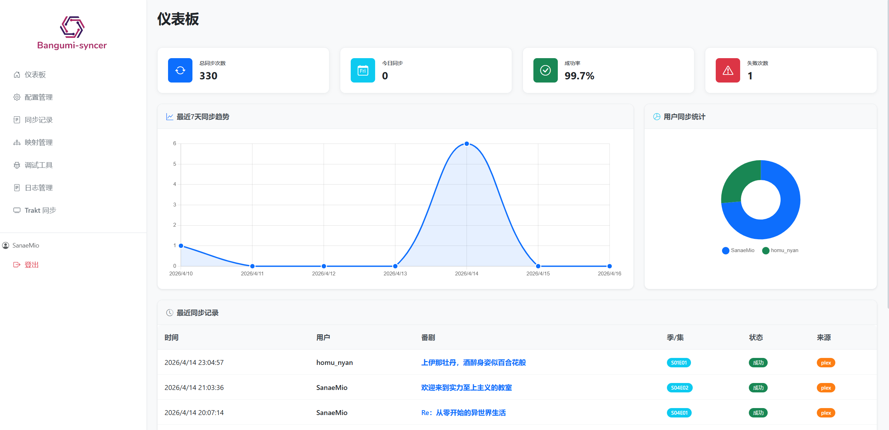

<strong>基于Webhook自动同步Bangumi打格子</strong>

[用户文档](https://sanaemio.github.io/Bangumi-syncer) | [快速开始](https://sanaemio.github.io/Bangumi-syncer/quick-start) | [Docker部署](https://sanaemio.github.io/Bangumi-syncer/quick-start/docker) | [参与开发](https://github.com/SanaeMio/Bangumi-syncer/blob/main/CONTRIBUTING.md)

## 📖 简介

Bangumi-syncer 是一款把常见媒体库与 [Bangumi（番组计划）](https://bgm.tv/)连接在一起的轻量级小工具。

你可以在 Plex、Emby、Jellyfin、Infuse(通过Trakt桥接)、飞牛等任意媒体库客户端里照常看番，看完一集后会自动调用 [Bangumi API](https://bangumi.github.io/api/) 打格子，免去频繁打开网站的烦恼，省时省力。

## ✨ 特性

- 🌐 **现代化 Web 管理界面**：仪表板统计、趋势与最近同步记录等可视化。
- ⚙️ **全流程在线配置**：所有配置项均可在 Web 中配置并热重载，支持配置备份与恢复。
- ✅ **看完即同步**：在媒体库标记看完后，由程序调用Bangumi 官方 API自动打格子。
- 🧠 **智能推理条目**：采用启发式推理，自动匹配媒体库标题与 Bangumi 条目（尤其是多季度和分割放送）。
- 🔌 **常见媒体栈都能接**：已内置适配 Plex、Emby、Jellyfin、Trakt、飞牛，也支持其他软件通过自行构建Webhook进行同步触发，覆盖了绝大多数场景。
- 👥 **多用户同步**：支持多用户模式，按媒体服务器用户名路由到不同 Bangumi 账号，数据不混杂。
- 🔔 **通知能力**：同步过程支持 Webhook 和 邮件 通知，模板与类型可高度自定义，便于接入Telegram、钉钉等软件通知或扩展更多状态同步能力。

## 📺 支持的媒体库、接入方式与支持情况

| 媒体库 / 播放端 | 接入方式 | 番剧单集看过 | 剧场版在看 | 剧场版看过 |
| --- | --- | --- | --- | --- |
| **Plex** | Tautulli(免费) | ✅ | ✅ | ✅ |
| **Plex** | 官方Webhooks(需Plex Pass) | ✅ | ✅ | ✅ |
| **Emby** | 服务器自带通知 | ✅ | ✅ | ✅ |
| **Jellyfin** | Webhook 插件 | ✅ | ✅ | ✅ |
| **Infuse** | 借助Trakt同步 | ✅ | ❌ | ✅ |
| **Trakt** | 定时任务拉取账户播放历史 | ✅ | ❌ | ✅ |
| **飞牛** | 定时只读数据库 | ✅ | ❌ | ✅ |
| **任意支持Webhook的播放器** | 自定义 Webhook | ✅ | ✅ | ✅ |

更多说明见 [接入使用总览](https://sanaemio.github.io/Bangumi-syncer/usage/)。

## 😘 贡献

作者并非专业 Python 开发者，纯兴趣，代码比较粗糙请见谅。

如果存在 bug 或想增加功能，欢迎 [提一个 Issue](https://github.com/SanaeMio/Bangumi-syncer/issues/new/choose) 或者提交一个 Pull Request。

参与开发前请先阅读仓库内的 [贡献指南](https://github.com/SanaeMio/Bangumi-syncer/blob/main/CONTRIBUTING.md)。

## 👏 鸣谢
本项目受到以下项目思路的启发或使用过其中的内容，在此表示衷心的感谢！

- [kjtsune/embyToLocalPlayer](https://github.com/kjtsune/embyToLocalPlayer)
- [bangumi-data/bangumi-data](https://github.com/bangumi-data/bangumi-data)
- [wabisabi525/fn-bangumi-sync](https://github.com/wabisabi525/fn-bangumi-sync)

## 📄 许可

[MIT](https://github.com/SanaeMio/Bangumi-syncer/blob/main/LICENSE) © SanaeMio

## ❤️ 贡献者

## ⭐ Star 历史

